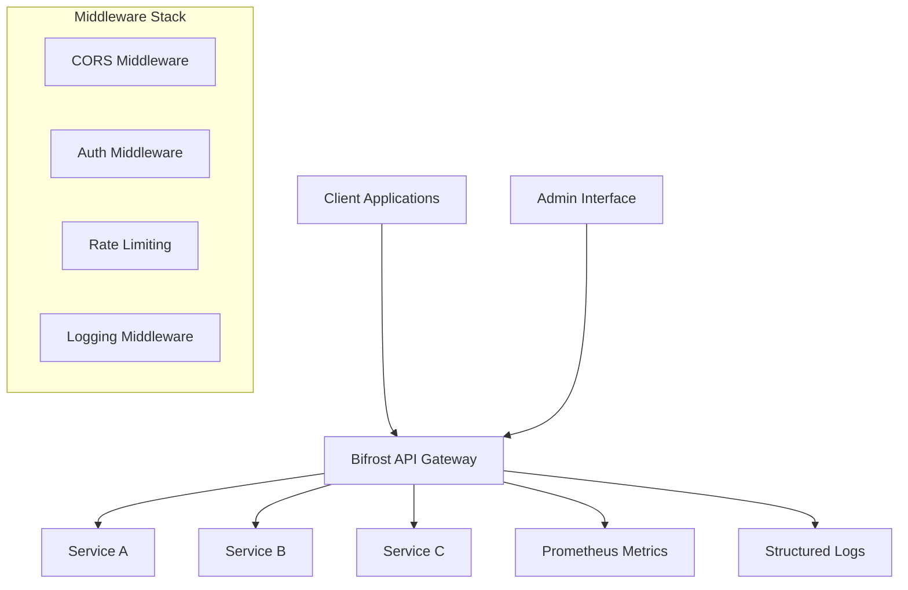

<p align="center">
    
</p>

<div align="center">

# 🌉 Bifrost (Bnbong + bifrost)

**API Gateway for Microservices**

[](https://python.org)
[](https://fastapi.tiangolo.com)
[](tests/)
[](https://github.com/psf/black)

*Part of the [BNGdrasil](https://github.com/BNGdrasil/BNGdrasil) ecosystem - A comprehensive cloud infrastructure project*

</div>

---

## Overview

**Bifrost** is a high-performance API Gateway built with FastAPI, designed to be the central entry point for microservices in the [BNGdrasil](https://github.com/BNGdrasil/BNGdrasil) cloud infrastructure. Named after the rainbow bridge in Norse mythology, Bifrost connects different services seamlessly while providing essential gateway features like request routing, load balancing, logging, and monitoring.

### Key Features

- **High Performance**: Built on FastAPI and asyncio for maximum throughput
- **Service Discovery**: Dynamic service registration and management
- **Security**: CORS, trusted hosts, and rate limiting middleware
- **Monitoring**: Prometheus metrics and structured logging
- **Admin API**: REST endpoints for service management
- **Health Checks**: Automatic service health monitoring
- **Request Proxying**: Intelligent request forwarding to backend services
- **Cloud Ready**: Docker support with environment-based configuration

---

## Architecture



### Core Components

- **API Router** (`src/api/`): RESTful endpoints for service management and health checks
- **Service Registry** (`src/services/`): Dynamic service discovery and management
- **Middleware Stack** (`src/core/middleware.py`): CORS, rate limiting, and logging
- **Configuration** (`src/core/config.py`): Environment-based settings management
- **Main Application** (`src/main.py`): FastAPI app factory and startup logic

---

## Project Structure

```
bifrost/
├── src/                    # Gateway Core
│   ├── api/               # Gateway API endpoints
│   ├── services/          # Service registry & management
│   ├── core/              # Configuration & middleware
│   └── main.py            # FastAPI application
├── admin/                 # Admin Dashboard (NEW)
│   ├── backend/           # Admin API (FastAPI)
│   │   ├── src/
│   │   │   ├── api/       # Admin API endpoints
│   │   │   ├── core/      # Auth, permissions, config
│   │   │   └── main.py
│   │   └── README.md
│   └── frontend/          # Admin UI (React + TypeScript)
│       ├── src/
│       │   ├── components/  # UI components
│       │   ├── pages/       # Dashboard pages
│       │   ├── services/    # API clients
│       │   └── App.tsx
│       └── README.md
├── tests/                 # Test suites
├── requirements.txt       # Python dependencies
└── README.md              # This file
```

### Admin Dashboard

The **Admin Dashboard** provides a web-based interface for managing the entire BNGdrasil system:

- **Backend** (`admin/backend/`): FastAPI-based Admin API server
  - User management
  - Service monitoring
  - System settings
  - Audit logs
  - Statistics and analytics

- **Frontend** (`admin/frontend/`): React + TypeScript Admin UI
  - Intuitive dashboard
  - Real-time metrics
  - Service status monitoring
  - User management interface
  - Integrated Grafana dashboards

**Access**: `https://admin.bnbong.xyz`

For detailed documentation, see:
- [Admin Backend README](admin/backend/README.md)
- [Admin Frontend README](admin/frontend/README.md)

---

## Quick Start

### Prerequisites

- **Python 3.12+**
- **Docker** (optional)
- **Redis** (for caching and rate limiting)
- **PostgreSQL** (for persistent storage)

### Installation

#### Using uv

```bash
# Clone the repository
git clone https://github.com/BNGdrasil/Bifrost.git
cd Bifrost

# Install dependencies
uv sync

# Activate virtual environment
source .venv/bin/activate

# Run the application
uvicorn src.main:app --reload --host 0.0.0.0 --port 8000
```

#### Using Docker

```bash
# Build and run
docker build -t bifrost .
docker run -p 8000:8000 bifrost
```

### Access Points

Once running, you can access:

- **API Gateway**: http://localhost:8000
- **Interactive Docs (only in development)**: http://localhost:8000/docs
- **Health Check**: http://localhost:8000/health
- **Metrics**: http://localhost:8000/metrics

---

## Service Configuration

Create `config/services.json` to define your backend services:

```json
{
  "user-service": {
    "url": "http://user-service:8001",
    "health_check": "/health",
    "timeout": 30,
    "rate_limit": 100
  },
  "payment-service": {
    "url": "http://payment-service:8002",
    "health_check": "/ping",
    "timeout": 15,
    "rate_limit": 50
  }
}
```

---

## API Reference

### Service Management

#### List Services

```http
GET /api/v1/services
```

#### Check Service Health

```http
GET /api/v1/services/{service_name}/health
```

#### Add Service (Admin)

```http
POST /api/v1/admin/services
Content-Type: application/json

{
  "name": "new-service",
  "config": {
    "url": "http://new-service:8003",
    "health_check": "/health",
    "timeout": 30,
    "rate_limit": 100
  }
}
```

#### Remove Service (Admin)

```http
DELETE /api/v1/admin/services/{service_name}
```

### Request Proxying

All requests to `/{service_name}/{path}` are automatically proxied to the registered service:

```http
# This request:
GET /api/v1/user-service/api/users/123

# Gets proxied to:
GET http://user-service:8001/api/users/123
```

### System Endpoints

- `GET /health` - Application health check
- `GET /metrics` - Prometheus metrics
- `GET /` - API information

---

## Monitoring & Observability

### Prometheus Metrics

Bifrost exposes metrics at `/metrics`:

- `http_requests_total` - Total HTTP requests by method, endpoint, and status
- `http_request_duration_seconds` - Request latency histogram
- `service_health_checks_total` - Service health check results
- `rate_limit_exceeded_total` - Rate limiting events

### Structured Logging

All logs are structured JSON format:

```json
{
  "timestamp": "2024-01-01T12:00:00Z",
  "level": "INFO",
  "event": "Request completed",
  "method": "GET",
  "path": "/api/v1/services",
  "status_code": 200,
  "duration": 0.042,
  "client_ip": "192.168.1.100"
}
```

### Health Checks

- **Application Health**: `GET /health`
- **Service Health**: Automatic background checks for registered services
- **Readiness**: Database and Redis connectivity checks

---

### Environment-Specific Configs

- **Development**: Auto-reload, debug logs, relaxed CORS
- **Production**: Optimized performance, security headers, rate limiting
- **Testing**: Isolated services, mock backends, fast execution

---

## Security

### Security Features

- **CORS Protection**: Configurable origin restrictions
- **Trusted Hosts**: Host header validation
- **Rate Limiting**: Per-IP request throttling
- **Secret Management**: Environment-based secrets
- **Input Validation**: Pydantic model validation
- **Error Handling**: Secure error responses

### Security Best Practices

1. **Never commit secrets** to version control
2. **Use environment variables** for configuration
3. **Enable rate limiting** in production
4. **Configure CORS** restrictively
5. **Monitor security metrics** regularly
6. **Keep dependencies updated**

---

## Deployment

### Production Deployment (VM2)

This service is deployed on **VM2** (Chuncheon region, Public subnet):
- **Location**: 10.0.1.60:8000 (private IP)
- **Public Access**: via VM1 Nginx reverse proxy (api.bnbong.xyz)
- **Resources**: 2 OCPU, 12GB RAM

### Docker Deployment

```bash
# 1. Build Docker image
docker build -t bifrost:latest .

# 2. Run container
docker run -d \
  -p 8000:8000 \
  --name bifrost \
  --env-file .env \
  bifrost:latest

# Or use docker-compose (on VM2)
docker-compose up -d gateway
```

### Manual Deployment to VM2

```bash
# 1. SSH to VM2
ssh ubuntu@<VM2_PUBLIC_IP>

# 2. Pull latest code
cd /opt/bnbong/gateway
git pull

# 3. Rebuild and restart
docker-compose build gateway
docker-compose up -d gateway

# 4. Check status
docker-compose logs -f gateway
```

### Environment Configuration (VM2)

Create `/opt/bnbong/.env` with:

```bash
ENVIRONMENT=production
AUTH_SERVER_URL=http://localhost:8001
REDIS_URL=redis://10.0.2.134:6379/0
LOG_LEVEL=INFO
RATE_LIMIT_PER_MINUTE=60
```

### Health Check

```bash
# From VM1 or external
curl http://api.bnbong.xyz/health

# From VM2 internally
curl http://localhost:8000/health
```

---

## BNGdrasil Ecosystem

Bifrost is part of the larger **[BNGdrasil](https://github.com/BNGdrasil)** cloud infrastructure project:

- **🌉 [Bifrost](https://github.com/BNGdrasil/Bifrost)** - API Gateway (this project)
- **🔐 [Bidar](https://github.com/BNGdrasil/Bidar)** - Authentication & Authorization Server
- **🏗️ [Baedalus](https://github.com/BNGdrasil/Baedalus)** - Infrastructure as Code (Terraform)
- **🌐 [Bsgard](https://github.com/BNGdrasil/Bsgard)** - Custom VPC & Networking
- **🎨 [Bantheon](https://github.com/BNGdrasil/Bantheon)** - Web Frontend & Portfolio
- **🎮 [Blysium](https://github.com/BNGdrasil/Blysium)** - Gaming Platform

Each component is designed to work independently while integrating seamlessly with others.

---

## License

This project is used for personal learning and development purposes.
